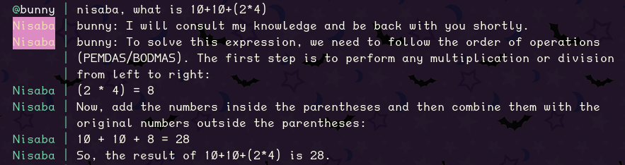

# nisaba



Nisaba is an IRC bot written in Go, designed to interact with users in a chat channel, using [llamafile](https://github.com/Mozilla-Ocho/llamafile) for generating responses.

## Background

Nisaba began as a project to learn [Go](https://go.dev/learn/), aimed at creating a frontend for interacting with local OpenAI or similar endpoints.

Initially, the project used [PrivateGPT](https://github.com/zylon-ai/private-gpt) as its backend for generating responses.

As the project evolved, the need for more flexible API options led to a transition to [llamafile](https://github.com/Mozilla-Ocho/llamafile).

This switch was motivated by llamafile's [ease of use](https://justine.lol/oneliners/) and its API endpoint being [llama.cpp](https://github.com/ggerganov/llama.cpp) compatible.

The included Docker container for Nisaba is built to include the llamafile binary, and serve an API endpoint for the Nisaba bot.

## Features

- Responds to messages directed at it by consulting llamafile for generating responses.
- Configurable customization options for the bot, such as setting a custom bot name.
- Supports dynamic loading of different API options for response generation.
- Ignores messages from users listed in a block list.
- Splits long messages to adhere to IRC's message length limits.
- Allows commands through IRC, such as clearing message history or loading new configuration options.

## Requirements

<details>
<summary><strong>Docker Setup</strong></summary>

The optional Docker container can be built to include all requirements.
- [Install Docker](https://docs.docker.com/engine/install/)

</details>

<details>
<summary><strong>Standalone Setup</strong></summary>

To build the standalone Go binary, you will need the build requirements.
- [Install Go](https://go.dev/doc/install)
- Go Dependencies
  - [github.com/thoj/go-ircevent](https://github.com/thoj/go-ircevent)
- Fully configured llamafile API endpoint

</details>

## Setup

Nisaba can be run either as a standalone application or within a Docker container.

Each method requires a configured `config.json` file, and optionally `options.json`, located in the `./config` directory.

<details>
<summary><strong>Docker Setup</strong> - Guide for deploying Nisaba with Docker, including llamafile.</summary>

1. **Prepare Configurations**
   - Place `config.json`, `options.json` (if used), and `model.gguf` in a directory named `config` in the same directory as your `docker-compose.yml`.
   - Example `options.json` files are provided under `config/` for popular API presets:
     - `options.precise.json.example` for "LLaMA Precise"
     - `options.divine.json.example` for "Divine Intellect"
     - `options.json.example` to reference all available options
   - Choose the configuration appropriate for your use case and rename it to `options.json`.

2. **Build and Run with Docker Compose**
   - Ensure the Docker Compose file is set to mount the `config` directory correctly:
     ```yaml
     version: '3.8'
     services:
       nisaba:
         build: .
         volumes:
           - ./model.gguf:/app/model.gguf
           - ./config:/app/config
     ```
   - Run the following command in the directory containing `docker-compose.yml`:
     ```
     docker-compose up --build
     ```

</details>

<details>
<summary><strong>Standalone Setup</strong> - Instructions for setting up Nisaba without Docker.</summary>

1. **Install Go**
   - If you haven't already, follow the instructions on the official [Go website](https://golang.org/dl/).

2. **Install Dependencies**
   - Install the IRC event package:
     ```
     go get github.com/thoj/go-ircevent
     ```

3. **Configure the Bot**
   - Create a `config` directory in your project root and place your `config.json` file within this directory. Optionally, add an `options.json` for additional parameters.
   - Example `options.json` files are provided under `config/` for popular API presets:
     - `options.precise.json.example` for "LLaMA Precise"
     - `options.divine.json.example` for "Divine Intellect"
     - `options.json.example` to reference all available options
   - Rename the relevant example file to `options.json` if you wish to use it.

4. **Build the Bot**:
   - Navigate to the project directory and run:
     ```
     go build -o nisaba.bin .
     ```

5. **Run the Bot**:
   - Start the bot by running the binary:
     ```
     ./nisaba.bin
     ```

</details>

## Configuration

<details>
<summary><strong>Configuration Files</strong> - Overview of various configuration files used by Nisaba.</summary>

- **config.json**: Main configuration for the IRC bot, specifying connection details and API settings.
- **options.json**: Optional parameters file designed to adjust llamafile's behavior, with settings like `temperature`, `top_k`, etc.
- **systemprompt.txt**: System prompt for Nisaba sent to the llamafile endpoint.
- **blocklist.txt**: Blocks specific IRC nicknames from interacting with Nisaba.
- **history.txt**: Stores message context dynamically; should not be edited manually.
- **llamafile_args.txt** (Docker only): Custom arguments to replace default llamafile settings under Docker.

These configuration files can also be placed in the same directory as the compiled binary.

</details>

## Usage

<details>
<summary><strong>Basic Interaction</strong> - How to interact with Nisaba.</summary>

To get a response from Nisaba, simply prefix your message with the bot's name, followed by your query. For example:

     ```
     Nisaba, how are you?
     ```
     
After sending a query or command, Nisaba will process the input and respond in the IRC channel based on the current configuration and any active settings modified by commands.

</details>

<details>
<summary><strong>Using Commands</strong> - Commands available for controlling Nisaba.</summary>

Nisaba supports several commands that can be used to control the bot or modify its behavior dynamically. These commands should be prefixed with the bot's name, followed by a comma or colon, and the command:

- **!clear**: Clears the message history stored by the bot. Useful for resetting the context in "chat" mode.
       ```
       Nisaba, !clear
       ```
- **!options [filename]**: Loads specific option settings from a file named `options.[filename].json` if present in the `config` directory. This allows you to dynamically change how Nisaba interacts with the llamafile API without restarting the bot.
       ```
       Nisaba, !options precise
       ```
- **!system [message]**: Attaches a system prompt to the next message that Nisaba sends to the llamafile endpoint, affecting how responses are generated.
       ```
       Nisaba, !system You will respond using 100 words or less.
       ```

</details>

## Disclaimer

<details><summary><strong>Software Disclaimer</strong></summary>

The code in this repository is provided "as-is" without any warranty of any kind, either expressed or implied. It is intended for research and educational purposes only. The authors and contributors make no representations about the suitability of this software for any purpose and accept no liability for any consequences resulting directly or indirectly from the use of this software.


By using this software, you acknowledge and agree to assume all risks associated with its use, understanding that you are solely responsible for any damage to your computer system or loss of data that results from such activities. You also acknowledge that this software is not intended for use in production environments or for commercial purposes.
</details>
